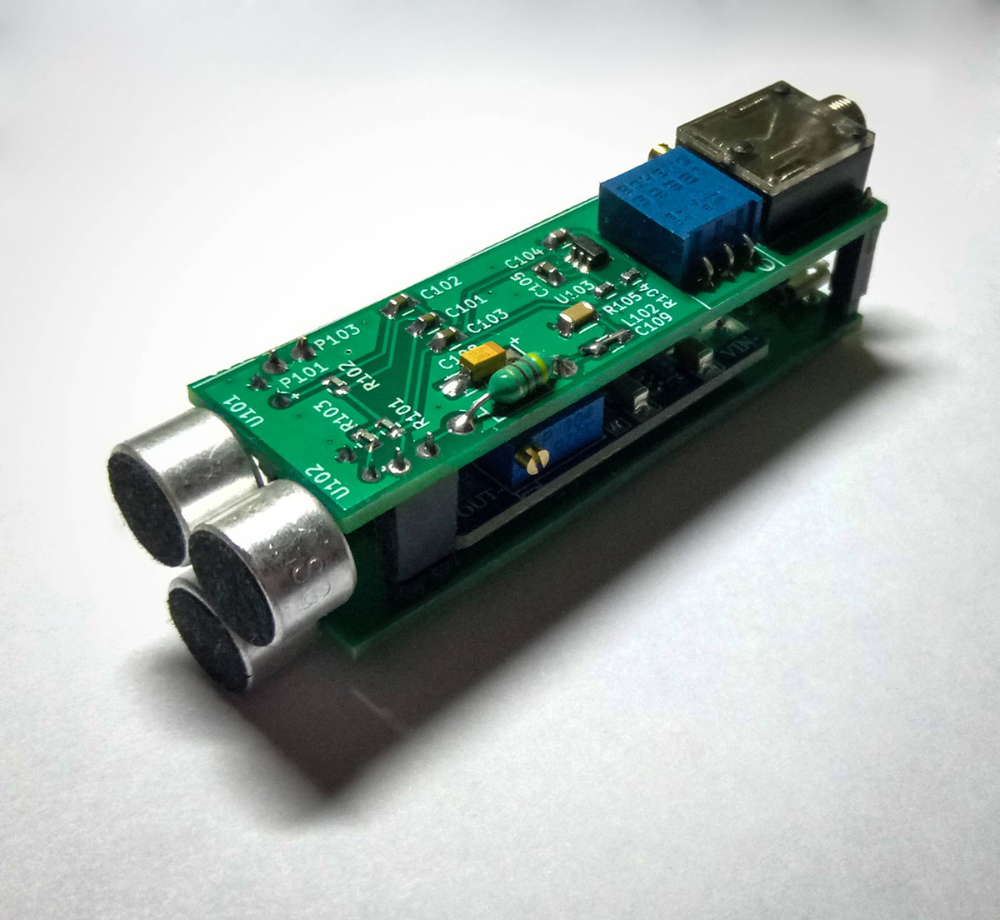
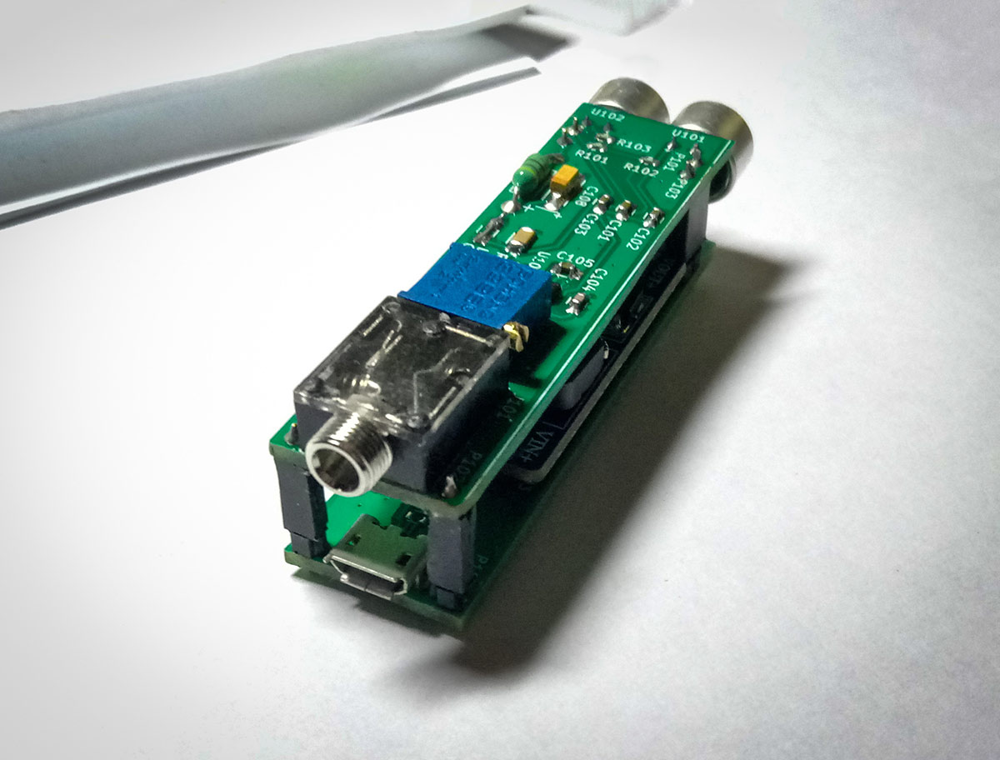
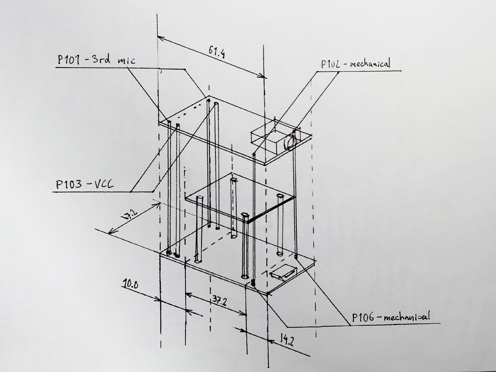

# microphone

PC microphone with a preamplifier. Supposed to be cheap and provide good sensetivity.

## Design

Based on TI's OPA172 reference design. Power is supplied through USB (micro-USB connector), upped to about 11V with a DC-DC converter, then regulated to 9V and filtered.

## Photos

## Parts

<table>
  <tr>
    <th>Refdes</th>
    <th>Kind </th>
    <th>Aliexpress </th>
    <th>Digikey</th>
  </tr>
  <tr>
    <td>J101 </td>
    <td>Audio connector </td>
    <td><a href="https://aliexpress.com/item/-/32663930559.html">PJ-324</a></td>
    <td>No direct replacement; SJ1-3514 and 35RAPC4BH3 are similar, but you will need to adjust the footprint</td>
  </tr>
  <tr>
    <td>P103, P105 </td>
    <td>DC-DC booster </td>
    <td><a href="https://aliexpress.com/item/-/32646997955.html">MT3608 DC-DC module</a></td>
    <td>—</td>
  </tr>
  <tr>
    <td>P102</td>
    <td>Micro USB connector </td>
    <td><a href="https://aliexpress.com/item/-/32386541159.html">Micro USB SMT</a></td>
    <td>?</td>
  </tr>
  <tr>
    <td>L101</td>
    <td>Inductor </td>
    <td><a href="https://aliexpress.com/item/-/32213528515.html">link</a></td>
    <td>78F471J-RC</td>
  </tr>
  <tr>
    <td>L102</td>
    <td>Inductor</td>
    <td><a href="https://aliexpress.com/item/-/1813786033.html">link</a></td>
    <td>MI0805K601R-10</td>
  </tr>
  <tr>
    <td>—</td>
    <td>Microphone</td>
    <td><a href="https://aliexpress.com/item/-/32584405608.html">link</a></td>
    <td>CMA-6542TF-K</td>
  </tr>
</table>

## Assembly notes

Adjust DC-DC converter voltage to about 11V. I used 2.54mm pin headers as standoffs for the converter.

